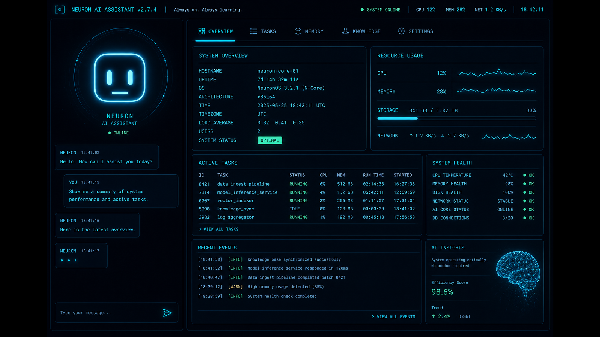
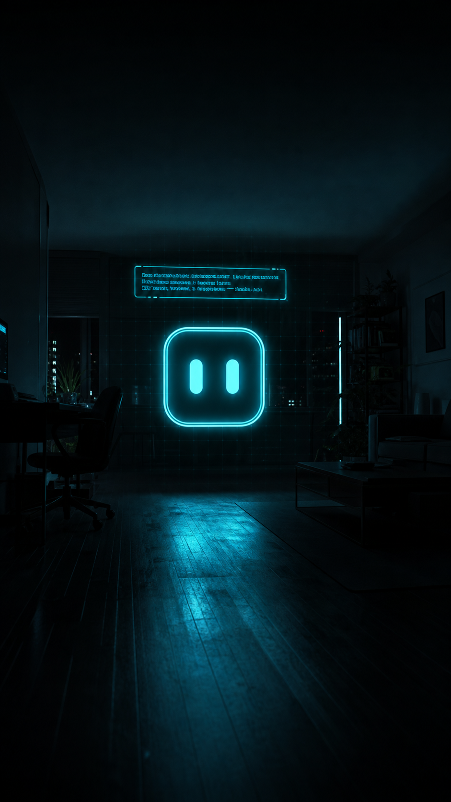

<p align="center">
  
</p>

# ◈ ALTER — Your AI Self

> It doesn't serve you. It **is** you — everywhere, all the time.

A personal AI self that lives on your phone. It knows the **world** (any LLM, plugged in with one free API key) and knows **you** (persistent, on-device memory). It has a face — an avatar that blinks, talks, and can be summoned into your room in **holo mode**, floating over your live camera. It hears you, speaks, and logs everything it does in a control plane you own completely.

**Local-first. No account. No backend. Your data never leaves your device.**

<p align="center">
  
</p>

---

## 🚀 Run your own in ~5 minutes (no code)

**Option A — Netlify Drop (fastest):**
1. Download this repo as a ZIP (or clone it)
2. Drag the **`app/`** folder onto [app.netlify.com/drop](https://app.netlify.com/drop)
3. Open the URL it gives you **on your phone** → *Add to Home Screen* → it's an app

**Option B — GitHub Pages (free, auto-deploys on every push):**
1. Push this folder to a new repo on GitHub
2. Repo → **Settings → Pages → Build and deployment → Source: `GitHub Actions`**
3. Done — the included workflow deploys `app/` automatically to `https://<you>.github.io/<repo>/`

**Optional (free) — unlock world knowledge:**
Get a free key at [aistudio.google.com](https://aistudio.google.com) (*Get API key*) → open the app → **MIND** tab → paste → **TEST CONNECTION**. Without a key, ALTER runs on its offline demo brain.

> Voice (🎤), holo mode, and installability work best on your phone's browser (Chrome / Safari).

---

## ✦ Features

| | |
|---|---|
| 🧠 **Swappable mind** | Offline demo brain by default; paste a free Gemini key for real world knowledge. The engine is an *interface* — any LLM (OpenAI, Anthropic, local models) can drop in. |
| 🧬 **Persistent local memory** | "remember my deadline is Friday" → "what do you know about me?" — stored on-device only. One-click **JSON export** and **wipe**. |
| 👁 **Holo mode** | The self rendered over your live camera feed — the hologram, for $0 in hardware. Try it in a dark room. |
| 🎤 **Voice in / out** | Web Speech STT + TTS, built in, free. |
| 📋 **Full audit log** | Every action the self takes appears in ACTIVITY. Full transparency, always. |
| 📱 **Progressive Web App** | Installable on iOS + Android, offline app shell, no app store. |

## 🗺 Roadmap

| Phase | What | Status |
|---|---|---|
| 0 | Control plane v0.1 — avatar, chat, local memory, audit | ✅ |
| 1 | **v0.2** — real mind (Gemini), voice, holo mode, PWA | ✅ (this release) |
| 2 | Agency-lite — tasks, reminders, daily digest, approvals | next |
| 3 | Landing page + first 10 users + launch video | |
| 4 | Proof + funding → **wrist AR hardware** (full spec in `docs/04`) | |

## 📁 Structure

```
alter/
├── README.md                 ← you are here
├── LICENSE                   (MIT)
├── .github/workflows/deploy.yml   (GitHub Pages auto-deploy of app/)
├── images/                   (README art)
├── app/                      ← the deployable PWA (drag this folder anywhere static)
│   ├── index.html            (the entire self — self-contained, offline-capable)
│   ├── manifest.webmanifest
│   ├── sw.js
│   └── icon-192.png / icon-512.png
└── docs/
    ├── 01-VISION.md          why this exists
    ├── 02-ARCHITECTURE.md    mind / memory / agency / face / plane
    ├── 03-ROADMAP-90DAYS.md  the $50 phone-first plan
    └── 04-WRIST-HUD-HARDWARE.md  funded-phase hardware spec (BOM, optics, thermal)
```

## 💸 The $50 build

The original build budget for this project:

| Item | Cost |
|---|---|
| LLM (Gemini free tier) | $0 |
| Voice + holo mode + PWA | $0 |
| Hosting (Netlify / GitHub Pages) | $0 |
| Paid LLM buffer (only if needed) | $10–20 |
| Domain (optional) | ~$10 |
| Contingency | $10–30 |

The hardware future (wrist hologram HUD) is fully specced in `docs/04` and waits for funding, not invention.

## 🔒 Privacy model

- **Memory is on-device only** (browser local storage; nothing is uploaded).
- **API calls are minimized**: your recent memories + the message. Nothing else.
- **Sovereignty**: one-click export (JSON) and one-click wipe. You are the data owner, full stop.
- The API key, if you add one, never leaves the device.

## 🏗 Made by

A mechanical engineering student who codes and builds websites — the self's hardware future (the wrist HUD) is where the degree kicks in. Built with a $50 budget and no server.

## 📄 License

[MIT](LICENSE) — fork it, name your own self, make it better.
